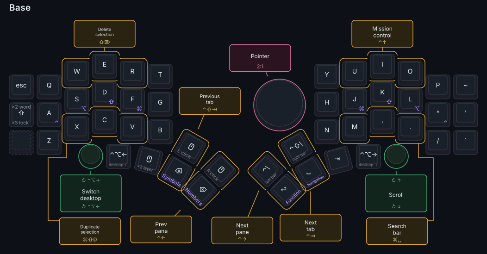
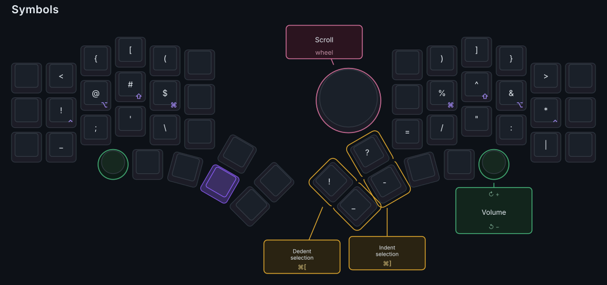
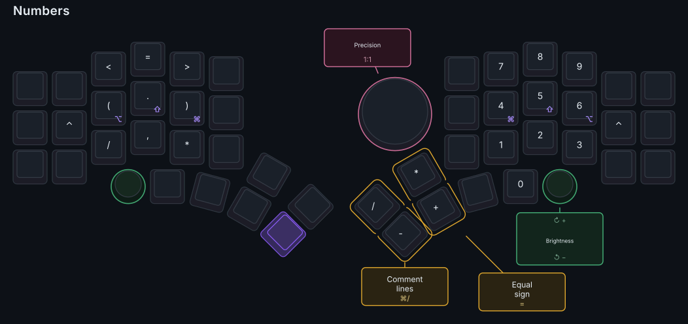
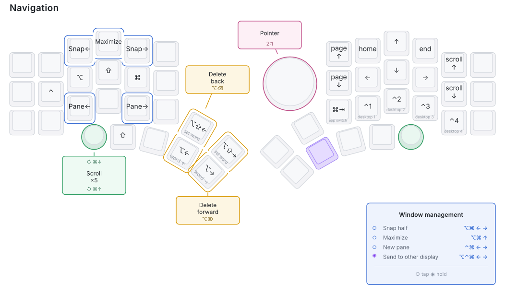
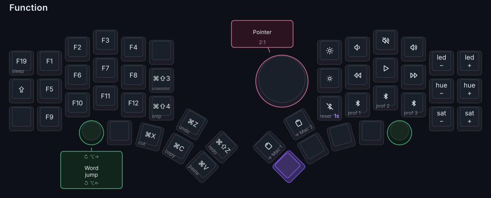
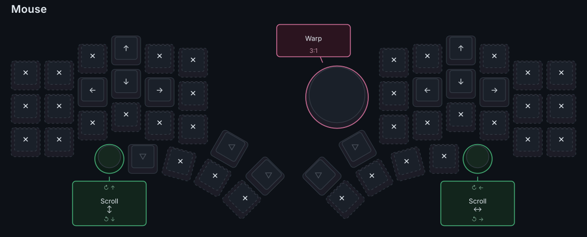

# Kyria Rev3 — ZMK Config

Wireless split running [ZMK](https://github.com/zmkfirmware/zmk), tuned for macOS: six layers off
four thumb keys, a Cirque trackpad that changes mode with the layer, and homerow mods that don't
misfire.

<!-- Photos of the finished build go here. -->

## Layers

| On a key                        | Means                                              |
| ------------------------------- | -------------------------------------------------- |
| Centre                          | what it types                                       |
| **Purple** text                 | what it does held — in the corner if it's a glyph   |
| **Purple** key                  | the key being held to reach this layer              |
| Grey, bottom left               | what the chord is for, where that isn't obvious     |
| Small above                     | double tap                                          |
| ▽                               | falls through to Base                               |
| **Amber** outline + card        | a combo: press those keys together                  |
| **Green** card                  | the rotary encoder — ↻ clockwise above, ↺ below     |
| **Pink** circle + card          | the trackpad and the mode this layer puts it in     |
| **Blue** outline + card         | one scheme shared by a group of keys, stated once — ○ tap, ◉ hold |

The round key on each half is that encoder; it takes the place of the outermost thumb switch. Most
combos pair an inner bottom-row key with the thumb key beside it, so the hand never moves.

### Base



`⌃⌥⇧⌘` on the homerow, mirrored. Each inner thumb key taps a key and holds a layer: `⌫` Symbols,
`⌦` Numbers, `⏎` Function, `␣` Navigation. `⌃⌥←`/`⌃⌥→` on the outer thumbs switch desktop, as does
the left knob; the right knob scrolls. Trackpad runs at 2:1.

### Symbols — hold `⌫`



Brackets on the top row ordered by nesting depth, `! @ # $` / `% ^ & *` on the homerow with the mods
still live. Trackpad becomes a scroll wheel.

### Numbers — hold `⌦`



Numpad right with mods intact, `0 - +` on the right thumbs; comparisons, parens and arithmetic on
the left. Trackpad drops to 1:1 precision.

### Navigation — hold `␣`



Arrows on the right homerow, bare mods on the left so they can be chorded. Window management top
left: snap left/right (hold sends the window to the other display), maximize, and new panes.
`⌃1`–`⌃4` for desktops, word jumps on the thumbs.

### Function — hold `⏎`



F-keys, media, screenshots, clipboard, three Bluetooth profiles (the key left of them clears all if
held a second), and underglow controls. The two clipboard thumb keys push the clipboard to the other
Mac (`⌃⌥⌘V`) and switch profile to follow it. `F19` sleeps the Mac.

### Mouse — double tap the middle-click key



Cursor keys mirrored on both hands. Any dashed key exits the layer. Trackpad goes to warp speed.

## Behaviours worth knowing

- **Timeless homerow mods** ([urob's pattern](https://github.com/urob/zmk-config#timeless-homerow-mods))
  — 200 ms term, 100 ms `require-prior-idle-ms`, opposite-hand trigger positions,
  `hold-trigger-on-release`. Mods never fire mid-word.
- **Caps key** — tap for sticky shift, or to clear caps word / caps lock if either is on; double tap
  for caps word, triple for caps lock. ZMK doesn't expose caps-word state, so the clearing lives in
  a local module: [`zmk-caps-clear/`](zmk-caps-clear/).
- **Mouse layer** — the middle-click key taps for a middle click, double taps to toggle the layer.

## Hardware

Kyria Rev3 · 2× nice!nano v2 · Cirque Pinnacle 40 mm on the right half · 128×64 OLED on the left ·
EC11 encoder per half · 31-LED underglow, purple by default.

## Build

```bash
./build.sh   # -> output/zmk_left.uf2, output/zmk_right.uf2
```

`./build_debug.sh` adds prerequisite checks and USB logging on the right half. Flash by
double-tapping reset on a half and copying its `.uf2` to the drive that mounts.

Diagrams come straight from the keymap: `pipx install keymap-drawer && ./generate_layout.sh`.
Legends and styling live in [`keymap-drawer/config.yaml`](keymap-drawer/config.yaml); the encoders
and combo legends are added by the two scripts beside it, which keymap-drawer has no notion of.

## Credits

[splitkb](https://splitkb.com) · [urob](https://github.com/urob) ·
[petejohanson](https://github.com/petejohanson) · [englmaxi](https://github.com/englmaxi) ·
[caksoylar](https://github.com/caksoylar) · MIT
