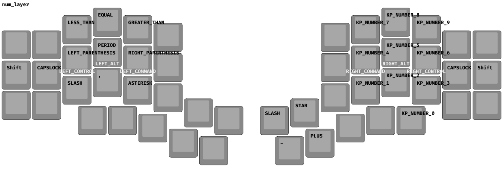
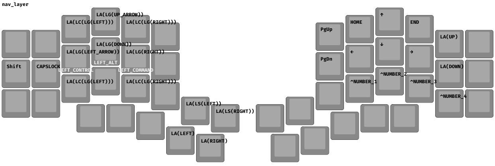

# Kyria Rev3 ZMK Configuration

A feature-rich ZMK firmware configuration for the [Kyria Rev3](https://splitkb.com/products/kyria-rev3) split ergonomic keyboard, featuring an integrated Cirque trackpad, OLED display, RGB underglow, and a carefully tuned typing experience. Optimized for developers and power users.

## Hardware

- **Keyboard**: Splitkb Kyria Rev3
- **Controllers**: nice!nano v2
- **Trackpad**: Cirque Pinnacle (40mm)
- **Display**: OLED (left half, dongle display)
- **Encoders**: EC11 rotary encoders (both halves)
- **Lighting**: WS2812 RGB underglow (31 LEDs)

## Features

### Cirque Pinnacle Trackpad

Full mouse control without leaving the home row. The trackpad behavior changes based on the active layer:

| Layer   | Mode      | Behavior                             |
| ------- | --------- | ------------------------------------ |
| Base    | Normal    | 2:1 scaling for everyday use         |
| Symbols | Scroll    | XY movement converts to scroll       |
| Numbers | Precision | 1:1 scaling for fine control         |
| Mouse   | Warp      | 3:1 scaling for fast cursor movement |

### Timeless Homerow Mods

Implements [urob's timeless homerow mods](https://github.com/urob/zmk-config#timeless-homerow-mods) pattern - a balanced hold-tap configuration that virtually eliminates misfires while maintaining a snappy typing experience.

### Smart Shift / Caps Word

The dedicated shift key uses a tap-dance behavior:

- **Single tap**: Sticky Shift (one-shot modifier)
- **Double tap**: Caps Word (auto-capitalizes until space/punctuation)

### OLED Display

Custom status screen on the left half showing:

- Current layer
- Modifier states (with Mac symbols)
- Connection status
- Battery level

### Rotary Encoders

Layer-aware encoder bindings:

| Layer      | Left Encoder      | Right Encoder      |
| ---------- | ----------------- | ------------------ |
| Base       | Desktop switching | Scroll up/down     |
| Symbols    | (disabled)        | Volume up/down     |
| Numbers    | (disabled)        | Brightness up/down |
| Navigation | Window zoom       | (disabled)         |
| Function   | Word navigation   | (disabled)         |
| Mouse      | Scroll up/down    | Scroll left/right  |

### RGB Underglow

31-LED underglow with full ZMK RGB control. Default color: purple (270° hue).

### Combos

Productivity-focused key combinations:

| Combo      | Layer   | Action                 |
| ---------- | ------- | ---------------------- |
| U + I + O  | Base    | Mission Control        |
| Thumb keys | Base    | Tab switching          |
| Thumb keys | Base    | Pane focus             |
| Thumb keys | Symbols | Indent/Dedent          |
| E + R + T  | Base    | Delete selection       |
| C + V + B  | Base    | Duplicate selection    |
| Bottom row | Any     | Search bar (Cmd+Space) |

## Layers

### Layer 0: Base (QWERTY)

Standard QWERTY with homerow mods and thumb cluster for layers/modifiers.


### Layer 1: Symbols

Programming-focused symbol layout with brackets on top row and special characters on home row.


### Layer 2: Numbers

Right-hand numpad with mathematical operators.



### Layer 3: Navigation

Arrow keys, page navigation, window management, and macOS desktop controls.



### Layer 4: Function

F-keys, media controls, screenshots, clipboard operations, and RGB controls.


### Layer 5: Mouse

Keyboard-driven mouse movement with WASD-style controls. Toggle via double-tap on middle click key.


## Building

### Prerequisites

- Python 3.x
- ARM toolchain (`brew install armmbed/formulae/arm-none-eabi-gcc`)
- CMake, Ninja, dtc

### Build Firmware

```bash
./build.sh
```

Outputs:

- `output/zmk_left.uf2` - Left half firmware
- `output/zmk_right.uf2` - Right half firmware

### Debug Build

```bash
./build_debug.sh
```

Includes verbose output, prerequisite validation, and USB logging for the right half.

### Generate Layout Images

```bash
./generate_layout.sh
```

Creates visual keymap representations in `./layouts/`.

## Flashing

1. Connect the keyboard half via USB
2. Double-tap the reset button to enter bootloader mode
3. Copy the appropriate `.uf2` file to the mounted drive
4. Repeat for the other half

## Dependencies

This configuration uses several community modules:

- [ZMK](https://github.com/zmkfirmware/zmk) - Core firmware
- [zmk-helpers](https://github.com/urob/zmk-helpers) - Keymap utilities
- [cirque-input-module](https://github.com/petejohanson/cirque-input-module) - Trackpad driver
- [zmk-dongle-display](https://github.com/englmaxi/zmk-dongle-display) - OLED display support

## Credits

- [splitkb](https://splitkb.com/) for the Kyria keyboard
- [urob](https://github.com/urob) for the timeless homerow mods pattern and zmk-helpers
- [petejohanson](https://github.com/petejohanson) for the Cirque input module
- [englmaxi](https://github.com/englmaxi) for the dongle display module

## License

MIT
